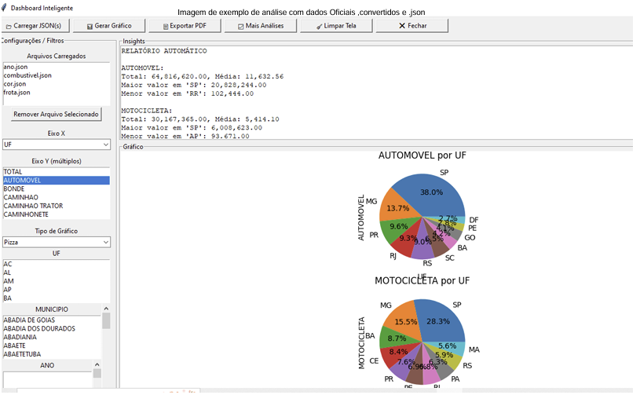

# Conhecendo os dados

A base de dados analisada foi composta a partir da junção de arquivos no formato JSON contendo informações relacionadas à distribuição de veículos por estado (UF), incluindo categorias como automóveis e motocicletas. Após o carregamento, foi realizado o tratamento inicial dos dados, incluindo o preenchimento de valores ausentes, garantindo maior consistência para análise.

A base apresenta variáveis categóricas, como UF, município e tipo de veículo, e variáveis numéricas relacionadas à quantidade de veículos. 

##  Medidas de Tendência Central

Foram analisadas medidas de tendência central para compreender o comportamento médio dos dados.

A categoria **automóveis** apresentou um total de **64.816.620** registros, com média de **11.632,56** por unidade de análise. Já a categoria **motocicletas** apresentou total de **30.167.365**, com média de **5.414,10**. 

A diferença entre os totais e médias indica que a distribuição não é uniforme entre as categorias, havendo predominância de automóveis em relação às motocicletas.

##  Medidas de Dispersão

A análise de dispersão evidenciou grande variação entre os estados.

Para automóveis, o maior valor foi observado no estado de **São Paulo (SP)**, com **20.828.244**, enquanto o menor valor ocorreu em **Roraima (RR)**, com **102.444**.

Para motocicletas, o maior valor também foi registrado em **São Paulo (SP)** (**6.008.623**), enquanto o menor ocorreu no **Amapá (AP)** (**93.671**).

Essa grande diferença entre valores mínimos e máximos indica **alta dispersão e desigualdade na distribuição dos dados entre os estados**.

##  Análise Gráfica

Os gráficos de pizza evidenciaram a distribuição percentual dos veículos por estado.

No caso dos automóveis:

- O estado de **São Paulo (SP)** concentra aproximadamente **38%** do total;
- Outros estados como **Minas Gerais (MG)** (~13,7%) e **Paraná (PR)** (~9,6%) também apresentam participação relevante. 

Para motocicletas:

- **São Paulo (SP)** também lidera com cerca de **28,3%**; 
- **Minas Gerais (MG)** (~15,5%) aparece em segundo lugar.

Esses resultados demonstram forte concentração em poucos estados.

## Identificação de Outliers

A grande diferença entre estados com valores muito altos (como SP) e estados com valores muito baixos (como RR e AP) indica a presença de **valores extremos (outliers)**.

Esses valores não necessariamente representam erros, mas sim diferenças estruturais reais, como tamanho populacional e nível de urbanização.

## Análise de Correlação

Embora não explicitamente quantificada no gráfico apresentado, a análise geral dos dados sugere que variáveis relacionadas à quantidade de veículos tendem a apresentar **correlação positiva**, já que estados com maior número de automóveis também apresentam maior número de motocicletas.

## Análise de Variáveis Categóricas

A variável categórica **UF** demonstrou forte concentração regional: 
- **São Paulo (SP)** se destaca amplamente como o estado com maior número de veículos; 
- Estados do Sudeste e Sul apresentam maior participação; 
- Estados do Norte possuem menor representatividade.
- 
Isso indica uma distribuição desigual entre as regiões do país. 

## Insights da Análise
A análise exploratória revelou padrões importantes:

- Forte concentração de veículos em poucos estados, especialmente em São Paulo; 
- Predominância de automóveis em relação às motocicletas; 
- Alta variabilidade entre estados, indicando desigualdade regional; 
- Presença de valores extremos que refletem diferenças socioeconômicas e populacionais. 

## Conclusão
A análise descritiva e exploratória permitiu identificar padrões relevantes na distribuição de veículos no Brasil, evidenciando concentração geográfica, diferenças significativas entre categorias e presença de valores extremos.

Esses resultados são fundamentais para compreender a estrutura dos dados e podem subsidiar análises futuras, como estudos de mobilidade, planejamento urbano e modelagem estatística.
