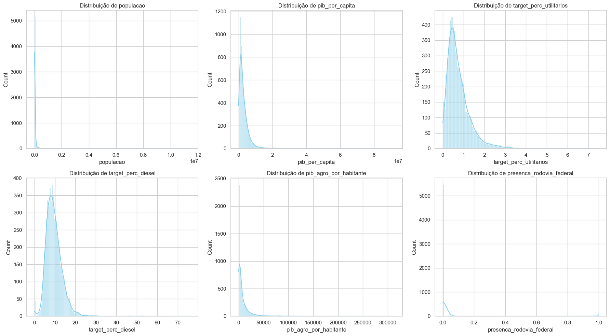
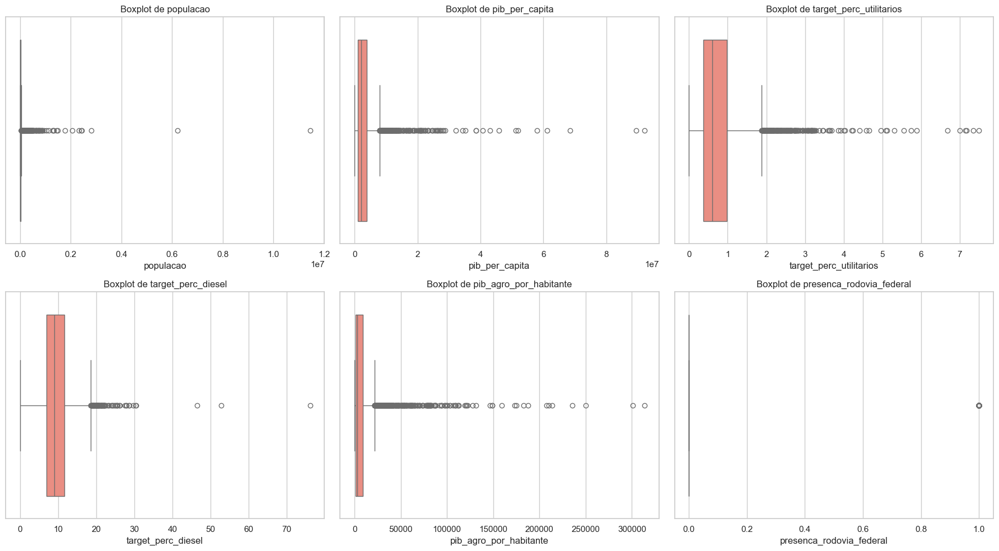
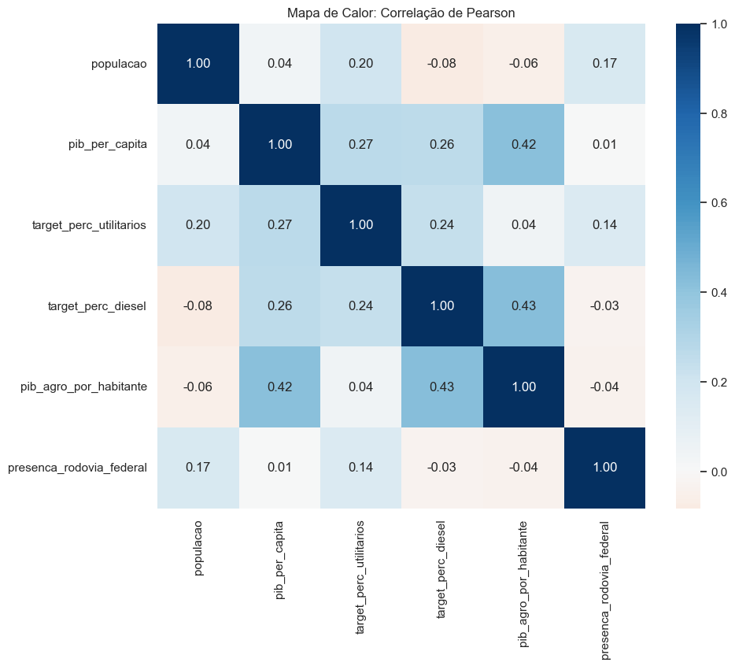

# Projeto de Análise e Modelagem de Frota Veicular Brasileira (Etapa 2)

Este repositório contém a análise descritiva e exploratória dos dados unificados para a predição de demanda por veículos utilitários e motorização diesel nos municípios brasileiros.

## 📊 Conhecendo os Dados

Nesta seção, realizamos uma investigação detalhada para compreender a estrutura do dataset, detectar _outliers_ e avaliar as relações entre as variáveis socioeconômicas e a frota nacional.

### Análise Estatística Descritiva

Abaixo, apresentam-se as medidas de tendência central e dispersão calculadas após a limpeza e unificação dos dados.

| Variável                | Média    | Mediana  | Desvio Padrão | Insight Técnico                                                |
| :---------------------- | :------- | :------- | :------------ | :------------------------------------------------------------- |
| **População**           | 36.453   | 11.064   | 206.500       | Assimetria à direita extrema (presença de metrópoles).         |
| **Target % Diesel**     | 9,52%    | 8,98%    | 3,89          | Distribuição próxima à normal, ideal para modelagem.           |
| **PIB Agro per capita** | R$ 8.220 | R$ 2.829 | R$ 16.805     | Alta variabilidade; motor principal da demanda rural.          |
| **Rodovia Federal**     | 0,019    | 0,00     | 0,139         | Variável binária (apenas 2% dos municípios com malha federal). |

> **Nota sobre a Escala:** O `pib_per_capita` foi processado em escala de magnitude específica para manter a sensibilidade às variações decimais durante o cálculo de correlação de Pearson, garantindo que o modelo capture diferenças sutis de riqueza.

### Decisões Estratégicas de Engenharia de Dados

Durante o processo de ETL e Análise Exploratória, tomamos decisões críticas para garantir a qualidade do modelo:

1.  **O Ponto Cego da Infraestrutura:** Identificamos que a variável `km_terra_por_habitante` apresentava baixa densidade de dados (baixa variância). Optamos por substituí-la pela variável binarizada `presenca_rodovia_federal` (1 se o município possui registro no DNIT, 0 caso contrário), funcionando como um indicador de polo logístico.
2.  **Temporalidade do PIB:** Detectamos que a base IBGE de 2023 não dispõe do detalhamento setorial (VAB). Por isso, retrocedemos o corte temporal para **2021** para as colunas de Agro, Indústria e Serviços, mantendo a precisão analítica.

---

## 📈 Visualização e Achados

### Distribuição e Outliers (Histogramas e Boxplots)

As visualizações permitiram identificar padrões de concentração e anomalias:

- **Histogramas:** Confirmaram o perfil "Long Tail" (cauda longa) do Brasil, onde a maioria dos municípios é pequena, justificando o uso de taxas percentuais em vez de valores absolutos.
  
- **Boxplots:** Revelaram _outliers_ agressivos. Detectamos um município onde **76% da frota é composta por diesel**, um ponto de interesse extremo para o modelo preditivo.
  
- **Identificação de Gigantes:** O outlier populacional isolado representa a cidade de São Paulo, enquanto os extremos de PIB per capita representam cidades com polos industriais ou extrativistas.

### Relações entre Variáveis (Mapa de Calor)

A análise de correlação de Pearson revelou os seguintes achados:

- **Conexão Agro-Diesel (0.43):** Correlação positiva moderada. Validamos que o agronegócio é, de fato, o principal impulsionador da motorização diesel.
- **População x Diesel (-0.08):** Correlação negativa que confirma que grandes centros urbanos priorizam veículos flex/gasolina.
- **Poder Econômico (0.26):** O PIB per capita também influencia a frota diesel, mas em menor escala que a vocação agropecuária específica.
  

### Scatter Plots

Gráficos de dispersão complementam a análise de correlação, permitindo visualizar a forma da relação (linear, exponencial, clusters). Os scatter plots de PIB Agro vs % Diesel evidenciam uma nuvem com tendência positiva, mas com dispersão significativa — sugerindo que variáveis adicionais (como região ou infraestrutura) são necessárias para explicar a variabilidade.

---

## 7. Considerações Éticas e LGPD

### 7.1. Conformidade com a LGPD
Os dados do SENATRAN e IBGE são estritamente públicos e agregados no nível municipal. Não contêm PII (CPF, placa, chassi, nome de proprietário), eliminando risco de reidentificação.

### 7.2. Risco de Falácia Ecológica
As correlações encontradas são entre **indicadores municipais**, não entre indivíduos. O correto é: *"municípios com alto PIB agropecuário tendem a ter maior proporção de diesel"*, e **não** *"pessoas ricas do agro compram diesel"*.

### 7.3. Risco de Estigmatização Regional
As disparidades Norte/Nordeste vs. Sul/Sudeste refletem condições socioeconômicas estruturais. Resultados devem ser comunicados sem juízos de valor sobre regiões.

### 7.4. Viés de Registro
Municípios-sede de locadoras possuem frotas desproporcionais. Isso deve ser explicitado na discussão dos resultados para evitar recomendações comerciais enviesadas.

---

## 8. Preparação para a Etapa 3

### 8.1. Variáveis-Alvo Definidas
- `target_perc_diesel` — para regressão supervisionada
- `target_perc_utilitarios` — para regressão supervisionada
- Clusters municipais — para K-Means (não supervisionado)

### 8.2. Features Candidatas
| Feature | Justificativa | Transformação |
|:---|:---|:---|
| `pib_agro_por_habitante` | Maior correlação com target (0.43) | Normalização |
| `pib_per_capita` | Indicador de riqueza geral | Normalização |
| `populacao` | Proxy de urbanização | Log transform |
| `densidade_demografica` | Indicador urbano/rural | Normalização |
| `presenca_rodovia_federal` | Polo logístico (binária) | Sem transformação |

### 8.3. Pré-processamento Necessário
- Excluir municípios com `populacao=0` (dados ausentes)
- Aplicar log transform em variáveis com assimetria extrema
- Normalizar features para K-Means (sensível a escala)
- Split treino/teste (70/30 ou 80/20)

### 8.4. Hipóteses a Testar
1. Municípios com maior PIB agropecuário per capita terão maior % de diesel
2. K-Means separará "Brasis Automotivos" com perfis de frota distintos
3. Random Forest superará Regressão Linear por capturar não-linearidades

---

## Ferramentas Utilizadas

- **Linguagem:** Python 3.11
- **Bibliotecas de Dados:** Pandas, NumPy, SciPy
- **Bibliotecas Gráficas:** Seaborn, Matplotlib
- **Ambiente:** Jupyter Notebook / VS Code

## Estrutura da Pasta src

| Arquivo | Descrição |
|:---|:---|
| [`ETL/script_etl_censo_demográfico.py`](../src/ETL/script_etl_censo_demográfico.py) | Tratamento de dados populacionais e densidade demográfica |
| [`ETL/script_ETL_dnit.py`](../src/ETL/script_ETL_dnit.py) | Processamento de infraestrutura e binarização |
| [`ETL/script_ETL_frota_RENAVAM.py`](../src/ETL/script_ETL_frota_RENAVAM.py) | Processamento de dados da frota brasileira |
| [`ETL/script_etl_PIB_municipios.py`](../src/ETL/script_etl_PIB_municipios.py) | Tratamento de dados econômicos |
| [`ETL/Dados Tratados/unificador_final.py`](../src/ETL/Dados%20Tratados/unificador_final.py) | Script mestre de integração das bases |
| [`analise_exploratoria.ipynb`](../src/analise_exploratoria.ipynb) | Notebook com visualizações e estatísticas |

## Instalação

```bash
pip install -r requirements.txt
```
