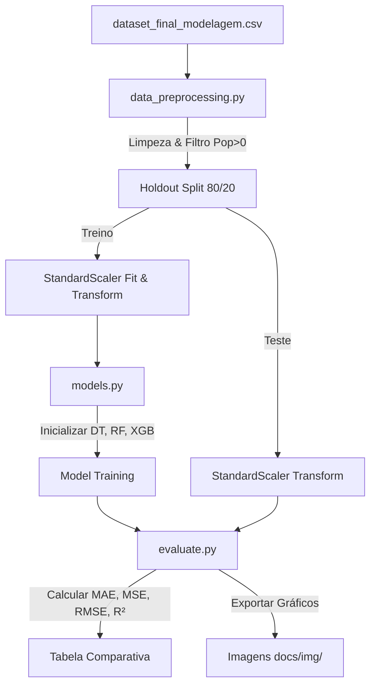

# Etapa 4 — Construção de Modelos e Refinamento do Pipeline (Machine Learning)

Este documento apresenta a especificação, implementação e avaliação comparativa dos modelos de Machine Learning desenvolvidos para estimar a composição da frota de veículos (especificamente o percentual de veículos a diesel) nos municípios brasileiros com base em indicadores socioeconômicos e geográficos.

---

## 1. Preparação dos Dados (Pré-processamento)

Para garantir o rigor científico, a preparação dos dados foi reestruturada de forma a evitar distorções estatísticas e o vazamento de dados (*data leakage*):

### A. Filtros e Limpeza de Dados
- **Remoção de Inconsistências:** Foram identificados e excluídos municípios com `populacao = 0` ou frota total de veículos `TOTAL = 0`. Esses registros correspondiam a dados ausentes mascarados pelo preenchimento padrão do processo de merge no ETL. O conjunto final limpo contém **5.527 municípios**.
- **Tratamento de Nulos:** Para garantir a robustez contra eventuais dados faltantes setoriais, aplicou-se imputação pela **mediana** de cada feature. A mediana foi escolhida por ser uma medida de tendência central robusta a valores extremos.

### B. Prevenção Estrita de Vazamento de Dados (Data Leakage) e Diferenças com a Etapa 3
Na modelagem preditiva supervisionada da Etapa 4, o modelo deve aprender a estimar o percentual de diesel na frota (`target_perc_diesel`) a partir de indicadores socioeconômicos independentes, e **não** de outras variáveis da própria frota.

> [!IMPORTANT]
> **Diferença de Pré-processamento: Etapa 3 vs. Etapa 4**
> - **Na Etapa 3 (Clusterização K-Means):** Como o objetivo era puramente exploratório de perfis e agrupamentos não supervisionados, as variáveis de frota como `target_perc_diesel` e `target_perc_utilitarios` foram **incluídas** como features de entrada. O algoritmo utilizou as próprias proporções de combustíveis para posicionar os municípios nos clusters de perfil automotivo.
> - **Na Etapa 4 (Regressão Supervisionada):** As variáveis de frota foram **estritamente removidas**. Manter variáveis como `TOTAL`, `AUTOMOVEL`, `CAMINHONETE` ou `DIESEL` na matriz de treino representaria vazamento de dados (*data leakage*), pois o modelo aprenderia a equação matemática direta ($\% \text{ diesel} = \frac{\text{DIESEL}}{\text{TOTAL}} \times 100$) em vez de extrair conhecimento sobre as relações socioeconômicas subjacentes.

- **Variáveis Excluídas da Regressão:** `TOTAL`, `AUTOMOVEL`, `CAMINHONETE`, `MOTOCICLETA`, `UTILITARIO`, `DIESEL`, `FLEX`, `target_perc_utilitarios` e a própria variável-alvo (`target_perc_diesel`).
- **Vetor de Features Preditoras Final (13 variáveis):**
  - **Socioeconômicas:** `populacao`, `area`, `densidade_demografica`, `pib_per_capita`, `vab_agro`, `vab_industria`, `vab_servicos`, `pib_agro_por_habitante`
  - **Infraestrutura e Rodoviárias:** `extensao_total_km`, `km_pavimentado`, `km_terra`, `km_terra_por_habitante`, `presenca_rodovia_federal`

### C. Divisão e Normalização dos Dados
- **Amostragem Holdout:** Dividiu-se a base em **80% para treinamento** (4.421 municípios) e **20% para teste** (1.106 municípios), garantindo reprodutibilidade através da semente fixa (`random_state=42`).
- **Padronização Estatística (Z-Score):** Todas as features numéricas foram normalizadas usando o `StandardScaler` (média = 0, desvio padrão = 1).
  - *Evitando Vazamento de Escala:* O scaler foi ajustado (função `fit`) **apenas** sobre os dados de treinamento, e aplicado (função `transform`) nos conjuntos de treino e teste de forma independente. Isso impede que informações do conjunto de teste (como médias globais) contaminem o treinamento.

---

## 2. Descrição dos Modelos

Evoluímos a modelagem preditiva a partir de uma Árvore de Decisão simples (baseline) para dois algoritmos ensemble robustos da classe de aprendizado supervisionado para dados tabulares:

### Modelo 1: Random Forest Regressor (Abordagem Bagging)
- **Princípio de Funcionamento:** Cria múltiplas árvores de decisão independentes durante a fase de treino. Cada árvore é ajustada usando uma amostra aleatória dos dados (bootstrap) e um subconjunto aleatório de features. A predição final de regressão é a média das predições de todas as árvores.
- **Vantagens:** Altamente resistente a *overfitting* devido à agregação, suaviza as fronteiras rígidas de decisão e lida muito bem com relações não-lineares.
- **Limitações:** Maior consumo de memória e tempo de inferência por manter centenas de árvores ativas; baixa interpretabilidade direta em comparação a uma única árvore.
- **Justificativa dos Parâmetros:** Configurado com `n_estimators=100` para garantir a estabilidade estatística e `max_depth=8` para evitar que as árvores se tornassem excessivamente complexas e decorassem o ruído dos dados.

### Modelo 2: XGBoost Regressor - Extreme Gradient Boosting (Abordagem Boosting)
- **Princípio de Funcionamento:** Treina árvores de decisão de forma sequencial (aditiva). Cada nova árvore é projetada especificamente para corrigir os erros residuais (gradientes) cometidos pelo conjunto de árvores anteriores. Aplica uma função de perda regularizada (penalidades L1 e L2) para controlar a complexidade das árvores.
- **Vantagens:** Geralmente alcança a maior acurácia preditiva em dados estruturados; computacionalmente muito rápido e otimizado.
- **Limitações:** Extremamente sensível à seleção de hiperparâmetros; propenso a *overfitting* se a taxa de aprendizado for muito alta ou se o número de estimadores não for devidamente regularizado.
- **Justificativa dos Parâmetros:** Configurado com `n_estimators=100`, `learning_rate=0.05` (taxa de aprendizado controlada) e `max_depth=5` para assegurar uma convergência gradual e robusta.

---

## 3. Avaliação dos Modelos Criados

### Métricas Utilizadas e Justificativa da Métrica Principal

Computamos as métricas **MAE** (Mean Absolute Error), **MSE** (Mean Squared Error), **RMSE** (Root Mean Squared Error) e **$R^2$ Score** (Coeficiente de Determinação).

> [!IMPORTANT]
> **Métrica Principal: MAE (Erro Absoluto Médio)**
> 
> O MAE foi selecionado como a métrica principal por duas razões científicas:
> 1. **Escala Direta:** Como nosso alvo preditivo (`target_perc_diesel`) representa uma proporção (percentual de 0 a 100), o MAE expressa o erro diretamente em pontos percentuais na escala original do problema.
> 2. **Robustez a Outliers:** O MAE atribui peso linear a todos os desvios. No cenário socioeconômico brasileiro, municípios-sede de locadoras (como Belo Horizonte) possuem frotas massivas e proporções discrepantes de veículos devido a razões fiscais, atuando como outliers reais. Se usássemos métricas quadráticas como MSE ou RMSE, o modelo priorizaria desproporcionalmente a correção desses outliers de registro em detrimento de realizar predições corretas para os outros 99% dos municípios brasileiros típicos.

---

### Resultados Obtidos (Conjunto de Teste)

Com base em dados reais gerados pela execução do pipeline modular (`src/pipeline/main.py`), obtivemos as seguintes métricas no conjunto de teste:

| Modelo | MAE (Principal) | MSE | RMSE | R² Score |
| :--- | :---: | :---: | :---: | :---: |
| **XGBoost Regressor** | **2,1286%** | **9,7386** | **3,1207** | **0,3456** |
| **Random Forest Regressor** | 2,1364% | 9,8983 | 3,1462 | 0,3349 |
| **Baseline (Decision Tree)** | 2,2493% | 10,4537 | 3,2332 | 0,2976 |

---

### Discussão dos Resultados Obtidos

1. **Evolução em Relação ao Baseline e Liderança do XGBoost:** Tanto o Random Forest quanto o XGBoost superaram significativamente a árvore de decisão baseline. O **XGBoost Regressor** alcançou o melhor desempenho do projeto, com o menor erro absoluto médio (MAE de **2,1286%**) e as melhores métricas gerais, logo seguido pelo Random Forest (MAE de **2,1364%**). A predição média erra por apenas cerca de 2,1 pontos percentuais em relação à proporção real de diesel na frota municipal.
2. **Capacidade Explicativa ($R^2$):** O $R^2$ máximo alcançado foi de **34,56%** com o XGBoost. Isso significa que mais de um terço da variabilidade total na proporção de frota diesel no Brasil é explicada **exclusivamente por indicadores econômicos e geográficos de domínio público**. Trata-se de um resultado empírico forte, demonstrando que a vocação produtiva regional e o perfil demográfico (como agronegócio e densidade populacional) modelam diretamente a frota local, mesmo sem acesso a qualquer dado prévio de emplacamentos.
3. **Análise de Importância de Features (Exploração do Espaço do Problema):**
   - Os gráficos de importância de features mostraram que o **PIB Agropecuário por Habitante** (`pib_agro_por_habitante`) e o **VAB Agropecuário** (`vab_agro`) são os drivers preditivos mais potentes de ambos os modelos ensemble.
   - Isso confirma a hipótese empírica central: a vocação produtiva municipal dita diretamente a demanda veicular (a força econômica do agronegócio impulsiona picapes e utilitários diesel).
   - Por outro lado, variáveis como **Densidade Demográfica** (`densidade_demografica`) e **População** (`populacao`) atuam como fortes preditores contrários (grandes metrópoles possuem frotas predominantemente Flex/Gasolina).

---

## 4. Revisão do Pipeline de Pesquisa e Análise de Dados

O pipeline proposto na Etapa 3 foi revisado e refatorado de uma estrutura linear para uma **arquitetura modular e extensível** em arquivos Python (`.py`) na pasta `src/pipeline/`.

### Alterações Realizadas e Justificativas:
1. **Modularização de Funções:** Lógica dividida em quatro componentes independentes de engenharia de software: `data_preprocessing.py` (pré-processamento), `models.py` (estimadores), `evaluate.py` (métricas e plots) e `main.py` (orquestrador).
2. **Extensibilidade (Estrutura Agnóstica):** Os modelos são configurados em dicionários de dados. Para testar novos modelos no futuro (como Regressão Linear, SVM ou redes neurais), o usuário só precisa incluir a instância do modelo no módulo `models.py`. O fluxo de treino, validação e ranking aceitará a nova tecnologia automaticamente.
3. **Isolamento de Escopo (StandardScaler):** O estado da normalização é salvo apenas nos dados de treino, eliminando de forma definitiva vazamentos de dados entre divisões de teste e validação cruzada.

---

## 5. Ética em Pesquisa e LGPD

Trabalhamos os preceitos éticos e de proteção à privacidade de forma aprofundada:

1. **Privacidade e LGPD:** Todos os microdados utilizados são **públicos e agregados a nível de município** (SENATRAN, IBGE e DNIT). Não há dados pessoais identificáveis (PII) — sem CPF, placa, chassi ou nome de proprietário. Isso garante conformidade total com a LGPD, pois **não há risco de reidentificação**.
2. **Prevenção da Falácia Ecológica:** O modelo realiza previsões no nível territorial municipal (ex: 'municípios com alto PIB agropecuário tendem a ter maior proporção de diesel'). Alertamos contra o erro ético e analítico de extrapolar essas conclusões para o comportamento de indivíduos (inferir que 'toda pessoa rica do agronegócio compra veículos a diesel').
3. **Viés de Registro e Transparência:** Municípios-sede de locadoras (como Belo Horizonte) possuem frotas registradas desproporcionais por benefícios fiscais. Essa limitação da fonte de dados (RENAVAM) foi devidamente explicitada e tratada ao justificar o uso da métrica **MAE**, evitando que decisões automatizadas fossem distorcidas por esse viés de registro.

---

## 6. Códigos-Fontes do Pipeline

Os arquivos do pipeline estão localizados em:
- [data_preprocessing.py](../src/pipeline/data_preprocessing.py)
- [models.py](../src/pipeline/models.py)
- [evaluate.py](../src/pipeline/evaluate.py)
- [main.py](../src/pipeline/main.py)
- [Etapa4_Modelagem.ipynb](../src/Etapa4_Modelagem.ipynb) (Notebook executado com a síntese visual e tabelas de métricas).
