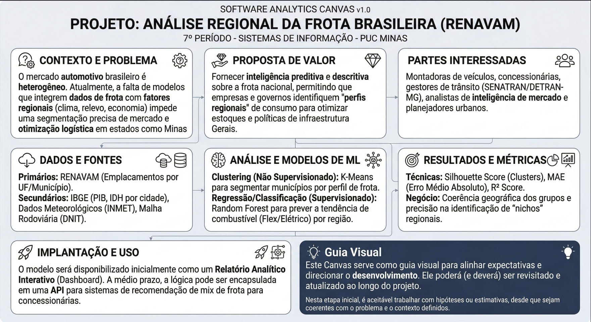

# Projeto: Pesquisa e Experimentação em Sistemas de Informação
## Análise da Variabilidade Regional do Mercado Automotivo Brasileiro via RENAVAM

---

## 1. Introdução
Este projeto surge na investigação focada para análise do **Registro Nacional de Veículos Automotores (RENAVAM)** com o objetivo de demonstrar como o mercado automotivo brasileiro é moldado por fatores regionais. O objetivo é utilizar Ciência de Dados e Aprendizado de Máquina para mapear como clima, cultura local, infraestrutura e perfil socioeconômico influenciam a frota de cada município. O público-alvo compreende gestores do setor automotivo, planejadores urbanos e analistas de mercado que buscam transformar dados públicos em decisões estratégicas.

## 2. Problema
O mercado automotivo brasileiro é tratado, muitas vezes, de forma homogênea em grandes relatórios nacionais, ignorando, por exemplo, que o "carro ideal" no sul de Minas Gerais pode ser drasticamente diferente da demanda no Norte do país. O problema reside na **dificuldade de identificar e quantificar essas variações regionais** de forma automatizada. Sem essa clareza, há desperdício logístico, estoques inadequados e falta de políticas públicas de mobilidade que atendam às necessidades específicas de cada localidade.

## 3. Questão de Pesquisa
> **"Como fatores socioeconômicos e geográficos influenciam a composição da frota veicular nos municípios brasileiros e de que forma modelos de aprendizado de máquina podem segmentar esses padrões regionais de consumo?"**

## 4. Objetivos Preliminares

### Objetivo Geral
Experimentar e avaliar modelos de aprendizado de máquina (Supervisionados e Não Supervisionados) para caracterizar a variabilidade regional do mercado automotivo brasileiro utilizando o dataset RENAVAM.

### Objetivos Específicos
1.  **Clusterização de Perfis:** Agrupar municípios brasileiros com base na similaridade de suas frotas (ex: polos de veículos pesados, cidades com predominância de motocicletas).
2.  **Análise de Tendência de Combustível:** Identificar variáveis socioeconômicas que mais impactam a adoção de veículos Flex, Diesel ou Elétricos em diferentes regiões.

## 5. Justificativa
A frota de veículos é um indicador direto da saúde econômica e da infraestrutura de uma região. 
* **Relevância:** Minas Gerais, por exemplo, possui uma das maiores frotas do país e um relevo que exige potências de motor específicas, justificando um estudo regionalizado.
* **Impacto Social/Econômico:** Otimizar a distribuição de veículos reduz custos operacionais em toda a cadeia de suprimentos. Além disso, entender a frota local permite que governos planejem melhor a transição energética e a manutenção de vias rodoviárias.

## 6. Público-Alvo
* **Analistas de Inteligência de Mercado:** Profissionais de montadoras e concessionárias que definem o mix de produtos por região.
* **Gestores Públicos (DETRAN/SENATRAN):** Para planejamento de arrecadação e políticas de transporte urbano.
* **Investidores de Infraestrutura:** Empresas que buscam locais para instalação de postos, oficinas ou pontos de recarga elétrica.

## 7. Estado da Arte

Nesta seção, documentamos 5 trabalhos acadêmicos brasileiros que tratam de problemas correlatos ao mercado automotivo e análise de dados regionais, servindo de base para as abordagens de Machine Learning deste projeto.

### 1. Clusterização de Municípios Brasileiros segundo Indicadores de Mobilidade (2021)
* **Problema e Contexto:** O trabalho agrupa os 5.570 municípios brasileiros para entender as carências de mobilidade, utilizando a frota como indicador principal.
* **Dados (Dataset):** Dados do RENAVAM/SENATRAN cruzados com indicadores socioeconômicos do IBGE.
* **Abordagem/Algoritmos:** Algoritmos de Clusterização (K-Means) para formação de grupos homogêneos de cidades.
* **Resultados:** Identificou perfis distintos de municípios (ex: cidades dependentes de motocicletas no Nordeste vs. alta densidade de automóveis no Sudeste).
* **Link:** [Repositório UFPE (Dissertação - Francisco J. V. Andrade)](https://attena.ufpe.br/bitstream/123456789/48662/1/DISSERTA%C3%87%C3%83O%20Francisco%20Jos%C3%A9%20Vasconcelos%20de%20Andrade.pdf)

### 2. Análise do Setor Automobilístico Brasileiro: Período Pandemia (2025)
* **Problema e Contexto:** Analisa as mudanças bruscas no consumo e na produção de veículos no Brasil entre 2019 e 2023.
* **Dados (Dataset):** Dados de emplacamentos (RENAVAM), indicadores do Banco Central e ANFAVEA.
* **Abordagem/Algoritmos:** Mineração de dados e análise de indicadores de mercado com foco em 15 marcas principais.
* **Resultados:** Mapeou como a inflação e o crédito alteraram o perfil da frota vendida no país, favorecendo modelos específicos.
* **Link:** [Repositório UFJF (Monografia - João Victor de Andrade e Souza)](https://repositorio.ufjf.br/jspui/bitstream/ufjf/18256/1/jo%C3%A3ovictordeandradeesouza.pdf)

### 3. Aspectos Econômicos e Sociais da Frota de Motocicletas no Nordeste (2020)
* **Problema e Contexto:** Estudo da variação regional da frota, focando na explosão do uso de motocicletas em relação aos automóveis em certas regiões do país.
* **Dados (Dataset):** Série histórica do DENATRAN (RENAVAM) de 2005 a 2019.
* **Abordagem/Algoritmos:** Análise espacial e estatística descritiva avançada.
* **Resultados:** Demonstrou que em 84% dos municípios do Nordeste a frota de motos supera a de carros, um padrão regional fortíssimo.
* **Link:** [Anais do ANPET (Congresso de Pesquisa em Transportes)](https://www.anpet.org.br/anais34/documentos/2020/Aspectos%20Econ%C3%B4micos%20Sociais%20Pol%C3%ADticos%20e%20Ambientais%20do%20Transporte/Transporte%20e%20Inclus%C3%A3o%20Social/2_221_AC.pdf)

### 4. Inteligência Artificial em Veículos Autônomos e Mobilidade Urbana (2025)
* **Problema e Contexto:** Revisão e aplicação de modelos de IA para entender como a frota brasileira pode se adaptar a novas tecnologias de mobilidade.
* **Dados (Dataset):** Bases de dados de tráfego e registros veiculares nacionais.
* **Abordagem/Algoritmos:** Deep Learning, Visão Computacional e Aprendizado de Máquina.
* **Resultados:** Propõe arquiteturas para prever o comportamento da frota em ambientes urbanos densos.
* **Link:** [Repositório Institucional CPS (Nathan V. Azevedo)](https://ric.cps.sp.gov.br/bitstream/123456789/35384/1/analiseedesenvolvimentodesistemas_2025_1_nathanvieiraazevedo_intelig%C3%AAnciaartificialemve%C3%ADculosaut%C3%B4nomos.pdf)

### 5. Utilizando Aprendizado de Máquina para Planejamento de Viagem e Consumo (2023)
* **Problema e Contexto:** Embora focado em veículos elétricos, o modelo prediz o consumo e a autonomia baseado no trajeto, algo que varia drasticamente conforme a região do Brasil (relevo/infraestrutura).
* **Dados (Dataset):** Dados reais de telemetria integrados a registros de categorias de veículos.
* **Abordagem/Algoritmos:** Regressão Linear Múltipla e Random Forest.
* **Resultados:** Precisão elevada na estimativa de autonomia para diferentes cenários de infraestrutura brasileira.
* **Link:** [SBC Open Lib (Anais do Workshop de Computação Urbana)](https://sol.sbc.org.br/index.php/courb/article/view/24568)

---

### Texto-Síntese Crítico

Os estudos analisados convergem para a conclusão de que o mercado automotivo brasileiro é profundamente heterogêneo, apresentando o que a literatura chama de "Brasis Automotivos". Há um consenso de que variáveis macroeconômicas, como o PIB regional e a oferta de crédito, são os principais preditores da densidade da frota. No entanto, os autores divergem sobre o peso dos fatores culturais: enquanto alguns estudos (Andrade, 2021) priorizam a funcionalidade (como a explosão das motocicletas no Nordeste por questões de custo e agilidade), outros focam na influência de políticas fiscais e incentivos estaduais na composição dos registros (RENAVAM).

Apesar do avanço nas técnicas de clustering, ainda persistem lacunas significativas na integração de dados qualitativos geográficos, como a influência do relevo e do clima nas especificidades técnicas dos veículos (potência de motor e acabamento interno). A maioria das pesquisas foca em grandes categorias (carro vs. moto), deixando de lado uma análise granular sobre preferências de modelos e combustíveis em nichos regionais específicos. Além disso, limitações éticas relacionadas à LGPD impõem desafios no cruzamento de dados de frotas com perfis socioeconômicos ultra-específicos, exigindo o uso de dados agregados por município.

Este projeto alinha-se às tendências mais recentes ao utilizar o RENAVAM como fonte primária, mas busca inovar ao cruzar esses registros com variáveis de infraestrutura e clima. Ao aplicar algoritmos como K-Means e Random Forest, pretendemos preencher a lacuna de "inteligência regionalizada", transformando a análise descritiva encontrada na literatura em um modelo preditivo capaz de segmentar o mercado com maior precisão para tomadas de decisão em estados com geografia complexa, como Minas Gerais.

## 8. Descrição do Dataset Selecionado

O conjunto de dados é composto por múltiplos arquivos extraídos do **Portal de Dados Abertos do SENATRAN**, referentes ao processamento de **2026**. Os dados representam o estoque total de veículos registrados em todo o território nacional, permitindo uma análise granular por localização e características técnicas.

### 8.1. Identificação e Origem
* **Fonte:** Secretaria Nacional de Trânsito (SENATRAN) – Ministério dos Transportes.
* **Arquivos Utilizados:** Frota por Município/Tipo, Frota por Combustível, Frota por Cor e Frota por Potência.
* **Licença:** Dados Públicos Abertos (Lei de Acesso à Informação).
* **Período:** Dados consolidados até o primeiro trimestre de 2026.

### 8.2. Atributos do Dataset
Abaixo, os principais atributos que serão integrados para a análise e modelagem:

| Atributo | Descrição | Tipo de Dado | Exemplo |
| :--- | :--- | :--- | :--- |
| `UF` | Unidade Federativa de registro do veículo. | Categórico (String) | MG, SP, RS |
| `Município` | Nome da cidade onde o veículo está registrado. | Categórico (String) | Belo Horizonte |
| `Tipo Veículo` | Categoria do veículo (Automóvel, Motoneta, Caminhão). | Categórico (String) | Caminhonete |
| `Combustível` | Tipo de propulsão (Flex, Diesel, Elétrico, GNV). | Categórico (String) | Elétrico |
| `Cor` | Cor predominante do veículo conforme registro. | Categórico (String) | Prata |
| `Potência` | Faixa de cavalaria (cv) do motor do veículo. | Ordinal (String) | 100cv a 140cv |
| `Quantidade` | Total de veículos que compartilham os mesmos atributos. | Numérico (Inteiro) | 2450 |

### 8.3. Qualidade dos Dados
* **Valores Faltantes:** Baixa incidência de dados nulos, concentrados principalmente em registros de veículos muito antigos (campos de Potência ou Combustível não preenchidos na época do registro original).
* **Inconsistências:** Presença de nomes de municípios com grafias diferentes (acentuação ou abreviações), exigindo um processo de normalização via código IBGE.
* **Outliers:** Municípios pequenos com frotas desproporcionais (comum em cidades que são sedes de grandes locadoras), que serão tratados durante a fase de pré-processamento para não enviesar os modelos de Machine Learning.

## 9. Canvas Analítico

## 10. Vídeo de Apresentação
[Vídeo de apresentação](https://drive.google.com/file/d/17RO2Y3i-K2n34B2k4yOEK4Fe7Iksg05c/view?usp=sharing)

## 11. Referências
* BRASIL. Ministério dos Transportes. **Dados Abertos SENATRAN**. Disponível em: [[link](https://www.gov.br/transportes/pt-br/assuntos/transito/conteudo-Senatran/estatisticas-frota-de-veiculos-senatran)]. Acesso em: 07 mar. 2026.
* *Adicionar demais referências*

---
