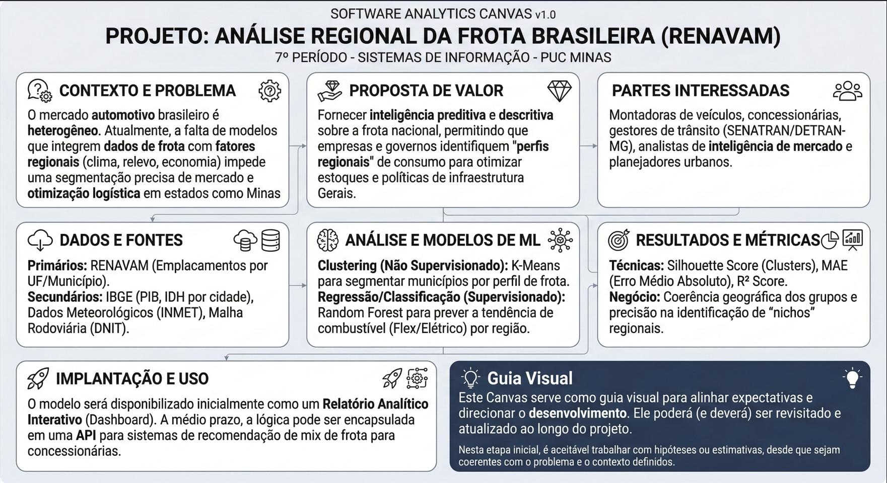

# Projeto: Pesquisa e Experimentação em Sistemas de Informação
## Análise da Variabilidade Regional do Mercado Automotivo Brasileiro via RENAVAM

---

## 1. Introdução
Este projeto investiga a composição da frota automotiva brasileira utilizando os microdados agregados do **Registro Nacional de Veículos Automotores (RENAVAM / SENATRAN)**. O mercado brasileiro, dadas as dimensões continentais do país, é heterogêneo. O objetivo é aplicar técnicas empíricas de Ciência de Dados e Aprendizado de Máquina para mapear e prever como características regionais (PIB, densidade demográfica, infraestrutura viária) influenciam a tipologia da frota de cada município. A intenção é transformar dados descritivos governamentais em inteligência preditiva para auxiliar montadoras na otimização de mix de produtos e governos no planejamento de infraestrutura (como postos de recarga e manutenção viária).

## 2. Problema e Recorte
Apesar da abundância de dados públicos, o setor automotivo frequentemente sofre com ineficiências logísticas por tratar a demanda de forma macrorregional, ignorando micro-padrões locais. O problema central da pesquisa é a **dificuldade de prever a composição específica da frota de um município com base em seus atributos socioeconômicos e geográficos**.

**Recorte da Pesquisa:** O projeto limitará seu escopo à predição e clusterização da frota de veículos leves e utilitários (picapes e SUVs) no ano de 2025/2026, focando em como a vocação econômica do município (ex: PIB Agropecuário vs. PIB Serviços) determina a predominância do tipo de veículo e combustível.

## 3. Questão de Pesquisa
> **"Em que medida os indicadores socioeconômicos e geográficos de um município podem atuar como preditores para a composição de sua frota veicular (tipo e combustível), e quais algoritmos de aprendizado de máquina apresentam melhor desempenho na modelagem dessa relação?"**

## 4. Objetivos e Precisão Metodológica

### Objetivo Geral
Desenvolver e avaliar modelos de aprendizado de máquina capazes de segmentar municípios brasileiros e prever a proporção de categorias específicas de veículos com base em indicadores socioeconômicos.

### Metodologia de Machine Learning (Objetivos Específicos)
Para garantir rigor metodológico, o projeto será dividido em duas frentes de modelagem:

1.  **Fase Não Supervisionada (Clusterização):**
    * **Técnica:** K-Means.
    * **Objetivo:** Descobrir agrupamentos naturais ("Brasis Automotivos") baseados na distribuição percentual da frota (ex: % Flex, % Diesel, % Motos).
    * **Métrica de Avaliação:** *Silhouette Score* e Método do Cotovelo (Elbow Method).
      
2.  **Fase Supervisionada (Regressão):**
    * **Problema:** Prever a proporção (percentual) de veículos utilitários/picapes em um município.
    * **Variável-Alvo (Target):** `% de Veículos Utilitários no Município`.
    * **Atributos Preditores (Features):** PIB per capita, % de PIB Agropecuário, Densidade Demográfica e Extensão de Vias não pavimentadas (dados IBGE/DNIT).
    * **Técnicas Testadas:** Regressão Linear Múltipla e Random Forest Regressor.
    * **Métricas de Avaliação:** MAE (Erro Médio Absoluto), RMSE (Raiz do Erro Quadrático Médio) e R² (Coeficiente de Determinação).

## 5. Justificativa
A passagem da análise conceitual para a empírica neste contexto é vital. O uso de modelos baseados em árvores (Random Forest) permitirá avaliar a importância das variáveis (*feature importance*), revelando se a renda dita o consumo mais do que a infraestrutura. O impacto prático atinge desde a cadeia de suprimentos de peças automotivas até a formulação de políticas de IPVA estaduais mais justas, baseadas na realidade empírica da frota em circulação.

## 6. Público-Alvo
* **Analistas de Inteligência de Mercado:** Profissionais de montadoras e concessionárias que definem o mix de produtos por região.
* **Gestores Públicos (DETRAN/SENATRAN):** Para planejamento de arrecadação e políticas de transporte urbano.
* **Investidores de Infraestrutura:** Empresas que buscam locais para instalação de postos, oficinas ou pontos de recarga elétrica.

## 7. Estado da Arte

Para fundamentar a modelagem, selecionamos cinco trabalhos recentes que aplicaram ciência de dados no setor automotivo/urbano. 

1. **Segmentação Socioeconômica dos Municípios de São Paulo Utilizando k-means (2024)**
   * **Dataset:** Dados oficiais de frota de veículos registrados por município e PIB/VAB do IBGE.
   * **Abordagem:** Algoritmo Não Supervisionado K-Means.
   * **Resultados:** Agrupou municípios paulistas com base na correlação entre características econômicas (PIB Agropecuário e Indústria) e o perfil da frota veicular, minimizando redundâncias dimensionais.  
   * **Similaridade e Lacuna:** O estudo é altamente similar por utilizar o K-Means para segmentar frotas municipais com base na economia. A lacuna aberta é o escopo regional restrito a São Paulo e a ausência de um modelo supervisionado (como Random Forest) que utilize esses clusters para prever proporções futuras da frota.
   * **Link:** [Anais do CONBREPRO 2024)](https://aprepro.org.br/conbrepro/anais/2024/arquivos/10242024_161035_671aa3a3db783.pdf)

2. **Aspectos Econômicos e Sociais da Frota de Motocicletas no Nordeste (Gomes et al., 2020)**
   * **Dataset:** Série histórica do DENATRAN/RENAVAM e dados demográficos do IBGE.
   * **Abordagem:** Regressão Linear Simples e Índice de Moran I Bivariado (Estatística Espacial).
   * **Resultados:** Comprovou estatisticamente que a frota de motocicletas é superior à de automóveis em 84% dos municípios nordestinos, correlacionando o fenômeno diretamente à densidade populacional e fatores de renda.
   * **Similaridade e Lacuna:** O trabalho valida a hipótese central deste projeto de que o Brasil possui forte heterogeneidade automotiva. A lacuna reside na abordagem: a modelagem é puramente econométrica e espacial, carecendo da aplicação de algoritmos não-lineares de Machine Learning para classificação preditiva.
   * **Link:** [Anais do Congresso da ANPET](https://www.anpet.org.br/anais34/documentos/2020/Aspectos%20Econ%C3%B4micos%20Sociais%20Pol%C3%ADticos%20e%20Ambientais%20do%20Transporte/Transporte%20e%20Inclus%C3%A3o%20Social/2_221_AC.pdf)

3. **Regras de Associação entre as Características dos Veículos e o Risco de Acidentes Graves (Araújo, 2022)**
   * **Dataset:** Banco de dados do RENAVAM (amostra com mais de 482 mil observações cruzadas) e registros da PRF.
   * **Abordagem:** Machine Learning Supervisionado (Classificadores) e Regras de Associação.
   * **Resultados:** O autor aplicou técnicas de dados para identificar padrões ocultos, associando atributos específicos dos veículos do RENAVAM (como potência do motor) a fatores de risco rodoviário.
   * **Similaridade e Lacuna:** Excelente exemplo da viabilidade de aplicar ML aos microdados do RENAVAM (incluindo tratamento de valores ausentes na variável de potência). A lacuna metodológica é o foco estrito em segurança viária, deixando em aberto a predição da composição estrutural da frota por região.
   * **Link:** [Repositório Institucional UFMG](https://repositorio.ufmg.br/bitstreams/95411a17-7312-4112-923d-5fabc26aa8a2/download)

4. **Análise da densidade do fluxo de veículos no centro da cidade: o caso de belo horizonte (Cardoso et al., 2022)**
   * **Dataset:** Dados espaciais de fluxo de tráfego, Google Maps e contagem veicular agregada.
   * **Abordagem:** Regressão Logística Multinomial.
   * **Resultados:** Desenvolveu um modelo preditivo linear generalizado capaz de categorizar a intensidade e densidade da frota em circulação com base em variáveis categóricas de tempo e localização.
   * **Similaridade e Lacuna:** Compartilha o uso de regressões avançadas para resolver problemas de mobilidade urbana veicular. A lacuna é o escopo de pesquisa de hiper-curto prazo e localidade restrita (apenas vias de um bairro), contrastando com a necessidade de modelos de longo prazo em nível de estado ou país.
   * **Link:** [Periódicos UFMG / Cadernos Leste](https://periodicos.ufmg.br/index.php/caderleste/article/download/13602/10776/122562)

5. **Modelos supervisionados para previsão de falhas em veículos pesados (Forsman, 2024 / Revista E&S, 2026)**
   * **Dataset:** Dados operacionais, de telemetria e características técnicas de frotas de veículos.
   * **Abordagem:** K-Means Clustering e modelos de Classificação Supervisionada.
   * **Resultados:** Demonstrou que a utilização combinada funciona: o K-Means agrupou a frota por características de aplicação semelhantes, facilitando aos modelos supervisionados a identificação de padrões determinísticos.
   * **Similaridade e Lacuna:** Combina exatamente as metodologias propostas no nosso projeto (Pipeline de Clusterização Não Supervisionada seguida de modelo Supervisionado) aplicadas a frotas. A lacuna recai na aplicação puramente mecânica da técnica, e não no cruzamento socioeconômico de mercado baseando-se em inteligência de dados abertos.
   * **Link:** [Revista E&S - Engenharia e Sustentabilidade](https://revistaes.com.br/resumo-executivo/modelos-supervisionados-para-previsao-de-falhas-em-veiculos-pesados)

**Síntese Comparativa:** A análise da literatura confirma a validade de cruzar bases públicas de mobilidade e socioeconomia para entender as disparidades regionais. Estudos como os de Gomes et al. (2020) e a segmentação de municípios paulistas (CONBREPRO, 2024) comprovam que indicadores do IBGE (IDH, PIB Agropecuário) explicam a heterogeneidade da frota, seja na predominância de motocicletas no Nordeste ou na densidade de veículos em São Paulo. Além disso, trabalhos focados em segurança e manutenção (Araújo, 2022; Forsman, 2024) validam a eficácia de aplicar pipelines combinados de Machine Learning — utilizando K-Means para agrupamento prévio seguido de modelos supervisionados — em dados automotivos complexos.

Entretanto, uma lacuna metodológica clara permanece: as pesquisas tendem a ser puramente descritivas/estatísticas em larga escala espacial, ou utilizam Machine Learning preditivo apenas em escopos hiper-localizados (como o fluxo no centro de Belo Horizonte analisado por Cardoso et al., 2022). O nosso projeto atua exatamente nessa intersecção. Propomos escalar o rigor dos algoritmos preditivos (Random Forest) para uma base nacional (RENAVAM atualizado), utilizando os clusters geoeconômicos (K-Means) não apenas para descrever o passado, mas para prever a composição estrutural futura da frota (tipos e combustíveis) de acordo com a vocação econômica de cada município.

## 8. Descrição do Dataset Selecionado
Para garantir a viabilidade da pesquisa, realizamos uma inspeção inicial rigorosa nos arquivos brutos disponibilizados pelo SENATRAN (Portal de Dados Abertos, ref. 2026).

### 8.1. Estrutura, Volume e Granularidade
* **Arquivos Inspecionados:** "Frota por Município e Tipo" e "Frota por Município e Combustível".
* **Volume:** O dataset bruto contém registros agregados de todos os 5.570 municípios, totalizando matrizes de milhares de linhas e colunas pivotadas por categoria veicular.
* **Granularidade:** Os dados não representam veículos individuais (não há chassi ou placa), mas sim contagens absolutas agrupadas por localização, tipo, cor e ano, garantindo anonimização total.

### 8.2. Inconsistências e Limitações Reais Encontradas
Durante a inspeção técnica, identificamos desafios que exigirão pré-processamento (ETL):
1. **Ausência de Código IBGE:** O dataset do SENATRAN utiliza o nome do município em formato *String* (ex: "SAO JOAO DEL REI"), muitas vezes sem padronização de acentos. Será necessário criar um script de similaridade (ex: *Fuzzy Matching*) para cruzar esses nomes com a base do IBGE (que contém a chave primária `cod_municipio_ibge`).
2. **O Viés das Locadoras:** Cidades como Belo Horizonte (MG) possuem frotas registradas desproporcionais à sua população devido à sede de grandes empresas de aluguel de carros, que licenciam veículos lá por benefícios fiscais. Se não for tratado como *outlier*, o modelo fará correlações espúrias (falsa correlação entre o PIB local e a frota gigante).

O conjunto de dados é composto por múltiplos arquivos extraídos do **Portal de Dados Abertos do SENATRAN**, referentes ao processamento de **2026**. Os dados representam o estoque total de veículos registrados em todo o território nacional, permitindo uma análise granular por localização e características técnicas.

### 8.3. Atributos do Dataset
Abaixo, os principais atributos que serão integrados para a análise e modelagem:

| Atributo | Descrição | Tipo de Dado | Exemplo |
| :--- | :--- | :--- | :--- |
| `UF` | Unidade Federativa de registro do veículo. | Categórico (String) | MG, SP, RS |
| `Município` | Nome da cidade onde o veículo está registrado. | Categórico (String) | Belo Horizonte |
| `Tipo Veículo` | Categoria do veículo (Automóvel, Motoneta, Caminhão). | Categórico (String) | Caminhonete |
| `Combustível` | Tipo de propulsão (Flex, Diesel, Elétrico, GNV). | Categórico (String) | Elétrico |
| `Cor` | Cor predominante do veículo conforme registro. | Categórico (String) | Prata |
| `Potência` | Faixa de cavalaria (cv) do motor do veículo. | Ordinal (String) | 100cv a 140cv |
| `Quantidade` | Total de veículos que compartilham os mesmos atributos. | Numérico (Inteiro) | 2450 |

### 8.4 Considerações Éticas e Limitações

A transição de um projeto de dados para o ambiente acadêmico exige rigor ético.

* **Adequação à LGPD:** Os dados utilizados do SENATRAN e IBGE são **estritamente públicos e agregados no nível municipal**. Por não conterem Informações Pessoalmente Identificáveis (PII) — como CPF, nome do proprietário, placa ou chassi —, a pesquisa anula o risco de reidentificação ou invasão de privacidade, estando em total conformidade com a Lei Geral de Proteção de Dados (LGPD).
* **Riscos de Viés e Interpretações Indevidas:** O principal risco metodológico é a **Falácia Ecológica** — o erro de deduzir características de indivíduos a partir de dados do grupo. Nosso modelo inferirá que "municípios com alto PIB Agropecuário tendem a ter mais picapes", e não que "indivíduos ricos no agro compram picapes". 
* **Limites da Inferência Territorial:** Como citado no viés das locadoras, o local de registro (RENAVAM) nem sempre corresponde ao local de circulação real do veículo. Esta limitação será explicitada na discussão final dos resultados gerados pelos modelos.

## 9. Canvas Analítico

## 10. Vídeo de Apresentação
[Vídeo de apresentação](https://drive.google.com/file/d/17RO2Y3i-K2n34B2k4yOEK4Fe7Iksg05c/view?usp=sharing)

## 11. Referências

ARAÚJO, [Ramon Batista]. Regras de Associação entre as Características dos Veículos e o Risco de Acidentes Graves. Dissertação/Tese – Universidade Federal de Minas Gerais (UFMG), Belo Horizonte, 2022. Disponível em: https://repositorio.ufmg.br/bitstreams/95411a17-7312-4112-923d-5fabc26aa8a2/download. Acesso em: 16 mar. 2026.

BRASIL. Ministério dos Transportes. Estatísticas de Frota de Veículos - SENATRAN. Portal de Dados Abertos, Brasília, DF, 2026. Disponível em: https://www.gov.br/transportes/pt-br/assuntos/transito/conteudo-Senatran/frota-de-veiculos-2026. Acesso em: 16 mar. 2026.

OLIVEIRA, GARCIA, LOBO, [Gabriel Luís Nogueira, Ricardo Alexandrino, Carlos] et al. Análise da densidade do fluxo de veículos no centro da cidade: o caso de Belo Horizonte. Cadernos Leste, Belo Horizonte, 2022. Disponível em: https://periodicos.ufmg.br/index.php/caderleste/article/download/13602/10776/122562. Acesso em: 16 mar. 2026.

CONBREPRO. Segmentação Socioeconômica dos Municípios de São Paulo Utilizando k-means. In: Anais do Congresso Brasileiro de Engenharia de Produção (CONBREPRO), 2024. Disponível em: https://aprepro.org.br/conbrepro/anais/2024/arquivos/10242024_161035_671aa3a3db783.pdf. Acesso em: 16 mar. 2026.

FONDA, FERREIRA, [Marina Vianna, Wallace G.]. Modelos supervisionados para previsão de falhas em veículos pesados. Revista Engenharia e Sustentabilidade, 2024. Disponível em: https://revistaes.com.br/resumo-executivo/modelos-supervisionados-para-previsao-de-falhas-em-veiculos-pesados. Acesso em: 16 mar. 2026.

MELLO, SILVA, MAIA, OLIVEIRA, [Carine Aragão, Carlos Fabricio Assunção, Maria Leonor Alves, Leise Kelli] et al. Aspectos Econômicos e Sociais da Frota de Motocicletas no Nordeste. In: Anais do XXXIV Congresso de Pesquisa e Ensino em Transportes (ANPET). Rio de Janeiro: ANPET, 2020. Disponível em: https://www.anpet.org.br/anais34/documentos/2020/Aspectos%20Econ%C3%B4micos%20Sociais%20Pol%C3%ADticos%20e%20Ambientais%20do%20Transporte/Transporte%20e%20Inclus%C3%A3o%20Social/2_221_AC.pdf. Acesso em: 16 mar. 2026.

---
